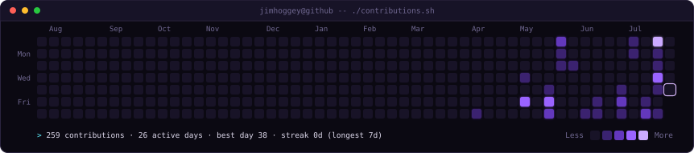
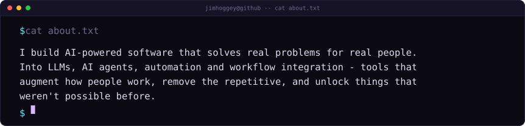
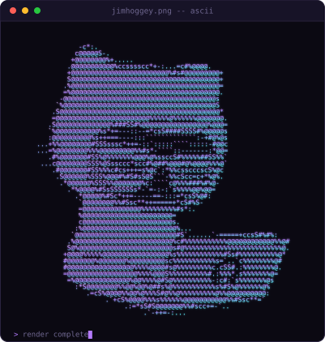
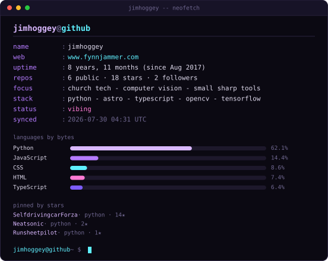

<div align="center">




<br /><br />

<h3><code>jimhoggey@github ~ $ cat about.txt</code></h3>



<br /><br />

<h3><code>jimhoggey@github ~ $ whoami</code></h3>

<table>
  <tr>
    <td valign="top"></td>
    <td valign="top"></td>
  </tr>
</table>

<br />

<a href="https://www.fynnjammer.com"><b>fynnjammer.com</b></a> &nbsp;·&nbsp;
<a href="https://github.com/jimhoggey/Runsheetpilot"><b>Runsheetpilot</b></a> &nbsp;·&nbsp;
<a href="https://github.com/jimhoggey/service-visuals"><b>service-visuals</b></a> &nbsp;·&nbsp;
<a href="https://github.com/jimhoggey/SelfdrivingcarForza"><b>SelfdrivingcarForza</b></a>

</div>

---

<details>
<summary><b>How this page is built</b></summary>

Four self-contained SVGs. GitHub strips JavaScript from rendered markdown but
happily renders SMIL animation inside an ``, so all the motion lives in
the SVG files themselves — no GIFs, no external services, nothing to rate-limit.

| File | What it is | Source of truth |
|---|---|---|
| `contrib-heatmap.svg` | 53×7 grid, cells sweep in diagonally | scraped from the public contributions calendar |
| `about.svg` | the blurb, typed out character by character | hand-written in `make_about_svg.py` |
| `ascii.svg` | avatar as a density-ramp portrait, wiped in row by row | `github.com/jimhoggey.png` |
| `info-card.svg` | neofetch-style summary, staggered fade-in | GitHub REST API |

### Generating them

```bash
python -m venv .venv && source .venv/bin/activate
pip install -r scripts/requirements.txt

python scripts/fetch_contributions.py   # -> data/contributions.json
python scripts/render_heatmap_svg.py    # -> contrib-heatmap.svg
python scripts/make_about_svg.py        # -> about.svg
python scripts/make_ascii_svg.py        # -> ascii.svg
python scripts/make_info_card.py        # -> info-card.svg
python scripts/check_svgs.py            # validates all four
```

`make_info_card.py` reads `GITHUB_TOKEN` if it is set, purely to avoid the
unauthenticated API rate limit. Only public data is ever read, so nothing from
a private repo can leak into the card.

`make_ascii_svg.py` accepts an optional image path if you would rather not use
the avatar:

```bash
python scripts/make_ascii_svg.py some-photo.png
```

### Two details worth knowing

**Whitespace.** SVG collapses runs of whitespace, so ASCII art built as
`<text>` rows with space padding falls apart — the surviving glyphs bunch up and
the grid shears. `make_ascii_svg.py` drops spaces entirely and gives every
remaining glyph an explicit `x`, which also pins the art to an exact grid no
matter which monospace font the renderer picks.

**Graceful degradation.** The usual way to stagger an entrance is `opacity="0"`
plus an animation that freezes at `1`. Anything that renders SVG *without*
running SMIL then shows a permanently blank image. Here every element already
holds its final value, and the animation runs from `t=0`, sitting on the hidden
value for its stagger before easing to the visible one — and deliberately does
not freeze, so it falls back to the element's own value. No SMIL means no
animation and a fully visible page. `check_svgs.py` enforces this by stripping
every animation and asserting nothing is left hidden.

### Staying fresh

[`update-profile-art.yml`](.github/workflows/update-profile-art.yml) re-renders
all four daily at 06:17 UTC and commits anything that changed. GitHub proxies
README images through its own cache, so an update can take a little while to
appear.

</details>
