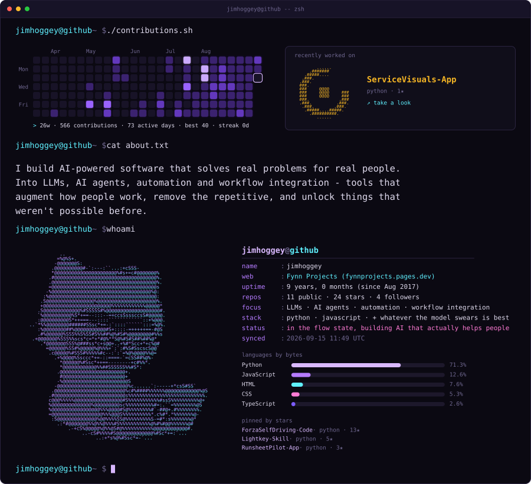

<a href="https://fynnprojets.pages.dev/"><b>Fynn Projects</b></a> &nbsp;·&nbsp;
<a href="https://jimhoggey.github.io/jimhoggey/"><b>this page, larger</b></a> &nbsp;·&nbsp;
<a href="https://github.com/jimhoggey/Runsheetpilot"><b>Runsheetpilot</b></a> &nbsp;·&nbsp;
<a href="https://github.com/jimhoggey/service-visuals"><b>service-visuals</b></a> &nbsp;·&nbsp;
<a href="https://github.com/jimhoggey/SelfdrivingcarForza"><b>SelfdrivingcarForza</b></a>

  

<a href="BUILDING.md">how this page is built</a>

